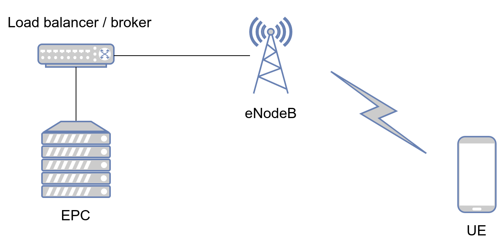
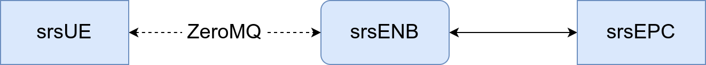
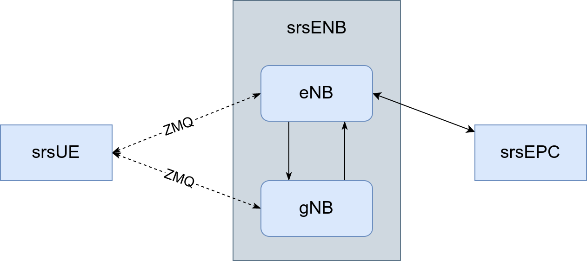

<style scoped>
    section {
        padding-left: 0;
    }

    .code-line {
        margin-top: 0;
        margin-bottom: 0;
        padding: 0;
    }

    h1 {
        margin-top: 1rem !important;
        margin-bottom: 2rem !important;
        font-size: 2rem;
        color: white;
    }

    div.names * {
        margin-bottom: 0.3rem !important;
    }
</style>

<!-- _class: center-vertical -->
<!-- _backgroundColor: #246; -->


#### University of Trento
## Virtualized mobile networks

# comnetsemu-srsRAN

<div class="names">

#### Leonardo Baldin
#### Ettore Saggiorato
#### Stiven Sharra
#### Prof. Fabrizio Granelli

</div>

---

# Overview
The aim of this project is to integrate both a a 4G and a 5G NSA network topologies in the [`comnetsemu`](https://github.com/stevelorenz/comnetsemu) network emulator.

The network stack is provided by the [srsRAN](https://github.com/srsran/srsRAN) (used to be srsLTE) project, a fully open source (free as in freedom) 4G/5G software suite.

---

# The software
- Vagrant provisions a custom VM based on `comnetsemu` with some small fixes
- `docker-compose` is used to test interoperability between srsRAN network nodes
- The topology scripts and supporting library are written in Python 3.8 (as is `comnetsemu`)
- These slides are rendered using [Marp](https://github.com/marp-team/marp)
- The build system for this project is written in Bash

---

# Implementation notes

- Three srsRAN components are used: EPC, eNodeB (ENB) and a simple UE
* The RF signals are sent directly from UE to ENB using ZeroMQ REQ-REP instead of a software-defined radio
* The ZeroMQ messages travel on the same network as EPC-ENB traffic but it's fine because ZeroMQ is strictly end-to-end
* The components use the default configuration with necessary tweaks, such as static IP assignment to the EPC

---

# Topology (high level view)

<!-- _class: big-img -->


<!-- The EPC will then connect to the internet -->

---

# Topology for 4G LTE (low level view)

<!-- _class: big-img -->


---

# Topology for 5G NSA (low level view)

<!-- _class: big-img -->



---

# Why not separate networks?

<!-- _footer: For more context, see [Github issue #12](https://github.com/stevelorenz/comnetsemu/issues/12) -->

<style scoped>
    ul {
        font-size: 27px;
    }
</style>

<!-- Cool trick, thank you https://github.com/marp-team/marpit/issues/137 -->
<div class="twocols">

- Mininet hates it when a single host is connected to two separate networks
* Mininet only attaches network interfaces to hosts **after** they've been started
  - This made `srsEPC`/`srsENB` stall execution since they couldn't connect
* A single network for all the traffic was deemed viable after testing

<p class="break"></p>

```python
# Create the host
epc = net.addDockerHost(
    name="srsepc", ...
)
# Save the command line string
cmds[epc] = "srsepc ..."

# Start network and interfaces
net.start()

# Run command inside each host
for host in cmds:
    host.cmd(cmds[host])
```

</div>

---

<style scoped>
    h1 {
        font-size: 4rem;
    }
</style>

<!-- _paginate: false -->
<!-- _class: center-vertical center-horizontal -->

# Demo

---

# Closing remarks
- `srsENB` supports only one UE per channel (each channel being a ZeroMQ REQ/REP pair) so a custom ZeroMQ broker is needed for faithful radio tower emulation
  - srsRAN can also use SUB/PUB ZeroMQ sockets (*not mentioned in the official documentation*)
- Multiple cells can be emulated via [S1 handover](https://docs.srslte.com/en/latest/app_notes/source/handover/source/index.html)
- The code provided is simple and very procedural (and full of hacks and workarounds) but it's a working, stable example of what can be done with srsRAN in a containerized environment

---

<style scoped>
    img {
        background-color: transparent;
    }

    .code-line {
        /* text-align: center; */
        margin-top: 0;
        margin-bottom: 0;
        padding: 0;
    }

    h1 {
        margin-top: 1rem !important;
        margin-bottom: 2rem !important;
        font-size: 1.8rem;
        color: white;
    }

    div.names *:not(:last-child) {
        margin-bottom: 0.3rem !important;
    }

    div.links {
        margin-right: 1rem;
        height: 100%;
        display: flex;
        flex-direction: column;
    }

    div.links > * {
        flex-grow: 1;
    }

    div.links * {
        display: flex;
        flex-direction: column;
        justify-content: center;
        align-items: center;
        text-align: center;
    }
</style>

<!-- _paginate: false -->
<!-- _class: center-vertical -->
<!-- _backgroundColor: #246; -->
<!--  -->


<div class="twocols">

<div class="links">

[](https://www.srsran.com/)

[](https://github.com/Baldomo/comnetsemu-srsran)

</div>

<p class="break"></p>

#### University of Trento
## Virtualized mobile networks
# comnetsemu-srsRAN

<div class="names">

#### Leonardo Baldin
#### Ettore Saggiorato
#### Stiven Sharra
#### Prof. Fabrizio Granelli

</div>
</div>