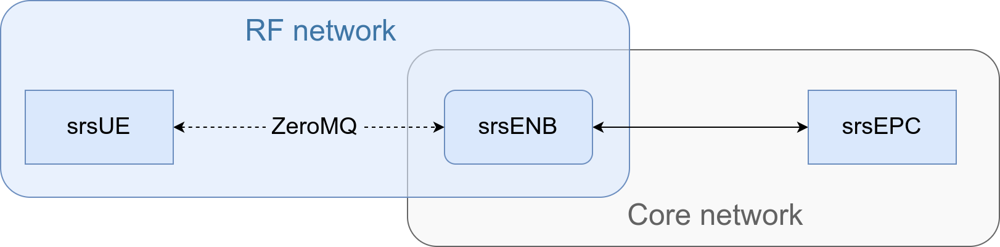

<!-- _class: center -->
<!-- _backgroundImage: linear-gradient(25deg, #00164f, #174f80, #1d8eb3, #04d2e9) -->


# <!-- fit --> comnetsemu-srsRAN

---

# Overview
The aim of this project is to integrate both a a 4G and a 5G NSA network topologies in the [`comnetsemu`](https://github.com/stevelorenz/comnetsemu) network emulator.

The network stack is provided by the [srsRAN](https://github.com/srsran/srsRAN) (used to be srsLTE) project, a fully open source (free as in freedom) 4G/5G software suite.

---

# The software
- Vagrant provisions the custom VM based on `comnetsemu` with some small fixes
- `docker-compose` is used to test interoperability between srsRAN network nodes
- The topology scripts and supporting library are written in Python (as is `comnetsemu`)
- These slides are rendered using [Marp](https://github.com/marp-team/marp)
- The build system for this project is written in Bash

---

# Implementation notes

* Three srsRAN components are used: EPC, eNodeB (ENB) and a simple UE
* The RF signals are sent directly from UE to ENB using ZeroMQ instead of a software-defined radio
* Two separate networks are required: one general use or emulating the internet and one for RF messaging
* The components use the default configuration with required tweaks, such as static IP assignment to the EPC

---

# Topology (high level view)

<!-- _class: big-img -->


---

# Topology (low level view)

<!-- TODO: add external internet connection -->

<!-- _class: big-img -->


---

# Demo

<!-- Cool trick, thank you https://github.com/marp-team/marpit/issues/137 -->
<div class="twocols">

```python
CORE_IPS: dict = {
    "epc": "10.80.95.10/24",
    "enb": "10.80.95.11/24",
}

# Fake network used for ZeroMQ data transfer
RF_IPS: dict = {
    "enb": "10.80.97.11/24",
    "ue": "10.80.97.12/24"
}
```

<p class="break"></p>

```python
CORE_IPS: dict = {
    "epc": "10.80.95.10/24",
    "enb": "10.80.95.11/24",
}

# Fake network used for ZeroMQ data transfer
RF_IPS: dict = {
    "enb": "10.80.97.11/24",
    "ue": "10.80.97.12/24"
}
```

</div>

---

# Demo

```python
CORE_IPS: dict = {
    "epc": "10.80.95.10/24",
    "enb": "10.80.95.11/24",
}

# Fake network used for ZeroMQ data transfer
RF_IPS: dict = {
    "enb": "10.80.97.11/24",
    "ue": "10.80.97.12/24"
}

class Simple4G:
    _daemon: bool = False
    _net: Containernet = None
    _hosts: list = []
```